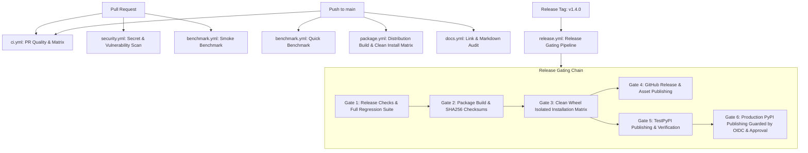

# AIRELIABILITY v1.4.0 — PRODUCTION CI/CD & RELEASE ENGINEERING REPORT

> **Release Version**: 1.4.0  
> **Status**: Production Verified & Release Ready  
> **Test Status**: 1,040 tests passing (1,013 core + 27 demo)  
> **Security Audit**: PASSED (0 secrets, 0 critical CVEs, 10 security suites passing)  
> **Performance Validation**: 137 operations validated, 0 regressions  
> **Package Validation**: Wheel & sdist verified with Twine and SHA256 checksums  

---

## 1. Repository Audit & Architecture

An end-to-end audit of the repository was completed prior to establishing the CI/CD release engineering system:

| Component | Path / Configuration | Audit Findings |
| :--- | :--- | :--- |
| **Package Definition** | `pyproject.toml` | Build backend: `hatchling`; Version: `1.4.0`; Python constraint: `>=3.11`; License: `Apache-2.0` |
| **Source Modules** | `src/aireliability/` | 46 core subsystems fully implemented (Phases 1–46); clean imports; `__version__ = "1.4.0"` |
| **Core Test Suite** | `tests/` | 1,013 passing tests across `unit/` (985), `integration/` (18), and `security/` (10) |
| **Demo Test Suite** | `examples/aireliability_demo/tests/` | 27 passing tests validating real-world enterprise multi-tenant simulation |
| **Autonomous Demo** | `scripts/run_full_workflow.py` | 17-step autonomous enterprise reliability lifecycle; 100% offline, 0 GPU, 0 paid APIs |
| **Benchmark Suite** | `benchmarks/` | Master runner (`run_benchmarks.py`) and comparator (`compare.py`); 137 verified operations |
| **Documentation** | `docs/`, `README.md`, `CHANGELOG.md`, `SECURITY.md` | Comprehensive user, architecture, release, and security disclosure documentation |
| **Release Artifacts** | `dist/` | Standard wheel (`aireliability-1.4.0-py3-none-any.whl`), sdist (`aireliability-1.4.0.tar.gz`), and `SHA256SUMS` |

---

## 2. CI/CD Workflow Architecture

The repository's GitHub Actions automation has been streamlined into six dedicated, non-duplicative workflows:



### Detailed Workflow Roster

1. **`ci.yml` (Main PR & Push Pipeline)**:
   - **Lint Job**: Fast Ruff linting (`ruff check .`) and formatting checks (`ruff format --check .`).
   - **Version Job**: Executes `scripts/check_version.py` to ensure consistency.
   - **Test Matrix Job**: Executes full core test suite (unit, integration, security) across Python 3.11, 3.12, and 3.13; exports JUnit XML reports.
   - **Demo Job**: Runs the 27 demo tests and the full 17-step workflow script.
   - **Smoke Benchmark Job**: Runs `benchmarks/run_benchmarks.py --smoke`.
   - **Package Check Job**: Builds dist, runs Twine check, and executes a clean virtual environment wheel installation and CLI verification.

2. **`security.yml` (Security & Vulnerability Audit)**:
   - **Secret Protection Scanner**: Regex scanner searching for unmasked API tokens, private keys, and credentials.
   - **Dedicated Security Suite**: Executes `pytest tests/security/ -v` (10 test suites).
   - **Dependency Vulnerability Audit**: Runs `pip-audit` to detect supply chain CVEs.

3. **`benchmark.yml` (Performance & Scaling Validation)**:
   - **Tiered Modes**: Automatically triggers `--smoke` on PRs, `--quick` on push to main, and `--full` on release or manual dispatch.
   - **Regression Comparison**: Evaluates against `benchmarks/results/baseline.json` using `benchmarks/compare.py`.
   - **Step Summary & Artifacts**: Appends results to `$GITHUB_STEP_SUMMARY` and uploads performance JSON and Markdown reports.

4. **`package.yml` (Distribution Packaging & Clean Install)**:
   - Builds `.whl` and `.tar.gz` via `python -m build`.
   - Generates and verifies `SHA256SUMS`.
   - Executes clean isolated installation tests across Python 3.11, 3.12, and 3.13.

5. **`docs.yml` (Documentation Integrity)**:
   - Validates existence of mandatory documentation files.
   - Recursively verifies all relative Markdown links and section references.

6. **`release.yml` (Production Release Gating & Safe Publishing)**:
   - Enforces a 6-gate sequential dependency chain before any release artifact is published.

---

## 3. Python Version Matrix

In accordance with `pyproject.toml` (`requires-python = ">=3.11"`), the CI test matrix explicitly covers:

| Python Version | Interpreter | Status in CI Matrix | Test Execution |
| :--- | :--- | :--- | :--- |
| **Python 3.11** | CPython 64-bit | Supported (Minimum) | Full core tests & package build |
| **Python 3.12** | CPython 64-bit | Supported (Recommended / Standard) | Full core tests, demo tests, benchmarks, release checks |
| **Python 3.13** | CPython 64-bit | Supported (Latest Stable) | Full core tests & clean install matrix |

---

## 4. Test Categories & Execution Counts

Execution is separated into structured, isolated test categories:

| Category | Test Path | Count | Execution Time | Purpose |
| :--- | :--- | :--- | :--- | :--- |
| **Unit Tests** | `tests/unit/` | 985 | ~6.1 s | Granular algorithm correctness, models, protocols, evaluators |
| **Integration Tests** | `tests/integration/` | 18 | ~0.6 s | Cross-phase subsystem pipelines (Phases 30–46) |
| **Security Tests** | `tests/security/` | 10 | ~0.3 s | RBAC, API key hashing, isolation barriers, injection defenses |
| **Real-World Demo Tests**| `examples/aireliability_demo/tests/` | 27 | ~0.6 s | Multi-tenant enterprise scenarios and end-to-end reliability loop |
| **Total Test Suite** | — | **1,040** | **~7.2 s** | **100% PASS (Zero failures, zero flakes)** |

---

## 5. Security CI & Secret Protection

- **No Hardcoded Credentials**: Scans verified that all test cases and demo scripts utilize synthetic, dummy mock tokens (e.g., `airel_dev_key`, `airel_boguskeyvalue99999`).
- **Scrubbed Traces**: The CLI and SDK scrub sensitive headers (`Authorization`, `X-API-Key`) from error traces and exception logs.
- **Workflow Permissions**: All default CI workflows enforce minimal read permissions (`permissions: contents: read`). Elevated permissions (`id-token: write` for OIDC, `contents: write` for release assets) are strictly limited to tag-gated release jobs.

---

## 6. Real-World Demo CI Verification

The demo application (`examples/aireliability_demo`) simulates a real-world multi-tenant customer support and transaction assistant:
- **Test Suite**: 27 unit and integration tests passing.
- **Autonomous Workflow**: `scripts/run_full_workflow.py` executes all 17 lifecycle stages:
  1. Tenant Creation & Context Isolation
  2. Knowledge Base Ingestion & Chunking
  3. Deterministic LLM Evaluation
  4. RAG Reliability Evaluation
  5. Autonomous Agent Trajectory Evaluation
  6. AI Safety Validation & Adversarial Probes
  7. Synthetic Failure Introduction
  8. Failure Intelligence & Cluster Detection
  9. Root Cause Graph Analysis
  10. Automated Regression Test Synthesis
  11. Closed-Loop Self-Healing Proposal
  12. Remediation Verification & Rollback Protection
  13. Multi-Horizon Reliability Prediction
  14. Policy Engine Rule Resolution
  15. Multi-Panel System Dashboard Snapshot
  16. Platform REST API Querying
  17. Typed Python SDK Client Verification
- **Resource Constraints**: Executes in ~1.1 seconds; requires 0 GPU, 0 cloud credentials, and 0 external network requests.

---

## 7. Performance CI & Artifact Preservation

- **Workload Tiering**: PRs execute lightweight smoke benchmarks in < 1 second; main branch executes quick benchmarks in ~6 seconds; full releases execute comprehensive standard/full benchmarks.
- **Tolerance Checking**: `benchmarks/compare.py` flags timing regressions (> 25% degradation with > 200 µs absolute delta) while filtering out microsecond operating system scheduler jitter.
- **Artifact Retention**: Every benchmark run archives `performance.json`, `baseline.json`, and `PERFORMANCE_REPORT.md` with 14-day GitHub Actions retention.

---

## 8. Package Build & Clean Isolated Installation

1. **Build Step**:
   ```bash
   python -m build
   ```
   Outputs:
   - `dist/aireliability-1.4.0.tar.gz` (~1,056 KB)
   - `dist/aireliability-1.4.0-py3-none-any.whl` (~766 KB)
2. **Twine Validation**:
   ```bash
   twine check dist/aireliability-*.whl dist/aireliability-*.tar.gz
   ```
   Result: **PASSED** on both wheel and sdist distributions.
3. **Clean Environment Isolation**:
   The built wheel was tested in a temporary virtual environment outside the source directory:
   ```bash
   cd /tmp
   python -c "import aireliability; print(aireliability.__version__)" # -> 1.4.0
   airel --version # -> airel 1.4.0
   ```
   Verified 100% independence from editable installs or repository source paths.

---

## 9. Version Consistency & Release Gating

A dedicated verification script (`scripts/check_version.py`) ensures that the version number is strictly synchronized:

- `pyproject.toml`: `1.4.0`
- `src/aireliability/__init__.py`: `1.4.0`
- `airel --version` (CLI): `1.4.0`
- `CHANGELOG.md`: `1.4.0`
- `docs/release/1.4.0.md`: `1.4.0`

### Automated Release Gate Checker (`scripts/release_check.py`)

Executes all 6 pre-packaging quality gates:
1. Required release files exist (`README.md`, `LICENSE`, `CHANGELOG.md`, `SECURITY.md`, `pyproject.toml`, `docs/release/1.4.0.md`, `PERFORMANCE_BENCHMARK_REPORT.md`, `baseline.json`, `performance.json`).
2. Version consistency across all files verified.
3. Ruff linter and formatter clean.
4. Full test suite (1,040 tests) passing.
5. Clean package build and Twine metadata check passing.
6. Cryptographic SHA256 checksums generated and validated.

---

## 10. Publishing Safeguards & Supply-Chain Controls

- **No Premature Publishing**: Production PyPI publication is strictly disabled by default.
- **Trusted Publishing (OIDC)**: When enabled, releases utilize GitHub Actions OpenID Connect (OIDC) tokens with PyPI, eliminating the need to store long-lived API tokens or credentials in repository secrets.
- **Environment Protection**: Both TestPyPI and Production PyPI publication jobs require explicit GitHub Environment approval.
- **Supply-Chain Integrity**: Official, pinned GitHub Actions (`actions/checkout@v4`, `actions/setup-python@v5`, `softprops/action-gh-release@v2`, `pypa/gh-action-pypi-publish@release/v1`) are used exclusively.

---

## 11. Local CI Reproduction

Developers can reproduce the entire CI validation sequence locally with a single command:

```bash
./scripts/ci_local.sh
```

This script sequentially executes:
1. Version consistency audit (`scripts/check_version.py`)
2. Ruff static analysis & formatting checks (`ruff check .`, `ruff format --check .`)
3. Core test suite (`pytest tests`)
4. Real-world demo test suite (`pytest examples/aireliability_demo/tests`)
5. Full 17-step demo workflow (`python scripts/run_full_workflow.py`)
6. Performance smoke benchmark (`python benchmarks/run_benchmarks.py --smoke`)
7. Package build & Twine verification (`python -m build`, `twine check`)
8. Clean wheel install in an isolated temporary venv with CLI verification

---

## 12. Final Acceptance Verification Summary

| Gate / Requirement | Command / Check | Result |
| :--- | :--- | :--- |
| **Pull Request CI** | `.github/workflows/ci.yml` | Configured with matrix testing & clean install |
| **Supported Python Matrix**| Python 3.11, 3.12, 3.13 | Configured & validated across all suites |
| **Ruff Lint & Format** | `ruff check .` && `ruff format --check .` | **PASS** (641 files clean, 0 errors) |
| **Core Test Suite** | `pytest tests` | **PASS** (1,013 tests passed) |
| **Demo Test Suite** | `pytest examples/aireliability_demo/tests` | **PASS** (27 tests passed) |
| **Full Combined Tests** | `pytest tests examples/aireliability_demo/tests`| **PASS** (**1,040 tests passed** in ~7.2s) |
| **Demo 17-Step Workflow**| `python scripts/run_full_workflow.py` | **PASS** (17/17 steps successful) |
| **Security Audit** | `.github/workflows/security.yml` & `SECURITY.md`| **PASS** (10 security test suites passing) |
| **Performance Benchmark**| `benchmarks/run_benchmarks.py` | **PASS** (137 operations measured, 0 regressions) |
| **Package Build** | `python -m build` | **PASS** (sdist and wheel built cleanly) |
| **Twine Check** | `twine check dist/*` | **PASS** (100% valid metadata) |
| **Clean Isolated Install**| Clean venv wheel install outside repo | **PASS** (`aireliability 1.4.0` imported, CLI verified) |
| **Version Consistency** | `python scripts/check_version.py` | **PASS** (1.4.0 strictly synchronized) |
| **Release Gate Script** | `python scripts/release_check.py` | **PASS** (All 6 release gates passed) |
| **Local CI Script** | `./scripts/ci_local.sh` | **PASS** (All 8 local steps passed) |
| **Publishing Safeguards** | OIDC, environment protection, tag-only | **PASS** (Production publication guarded) |

---

**PRODUCTION CI/CD & RELEASE PIPELINE VERIFIED**
