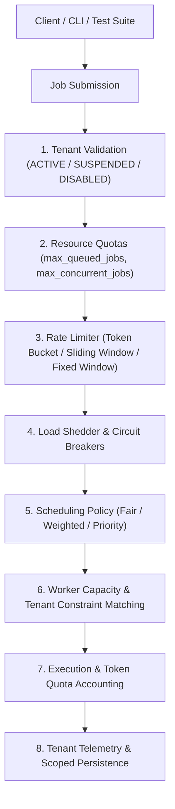

# Multi-Tenancy, Isolation & Resource Governance (Phase 27)

Phase 27 evolves `aireliability` into a production-grade multi-tenant reliability and evaluation platform while preserving 100% backward compatibility and keeping the core package provider-neutral.

---

## Architecture Overview



The system establishes complete technical boundaries:
- **Tenant**: Top-level administrative and billing boundary (e.g. `tenant-alpha`).
- **Project**: Team or subsystem partition within a tenant (e.g. `proj-checkout`).
- **Namespace**: Logical workspace or stage (e.g. `staging`, `production`).

---

## 1. Tenant Lifecycle & Model

Every tenant entity carries:
- `tenant_id`: Unique identifier.
- `name`: Display name.
- `status`: Lifecycle state (`ACTIVE`, `SUSPENDED`, `DISABLED`).
- `created_at`: Registration timestamp (UTC).
- `quota`: Configured `ResourceQuota`.
- `metadata`: Sanitized tenant-specific properties.

```python
from aireliability.tenancy import Tenant, TenantStatus, ResourceQuota

tenant = Tenant(
    tenant_id="tenant-acme",
    name="Acme Corporation",
    status=TenantStatus.ACTIVE,
    quota=ResourceQuota(
        max_concurrent_jobs=10,
        max_queued_jobs=100,
        max_workers=5,
        max_tokens=1_000_000,
    ),
)
```

---

## 2. Resource Quotas & Usage Tracking

Configurable tenant-level quotas:
- `max_concurrent_jobs`: Cap on concurrently running jobs across workers.
- `max_queued_jobs`: Bounded in-flight queue depth per tenant.
- `max_workers`: Upper bound on dedicated workers.
- `max_retries_per_job`: Override ceiling for retry attempts.
- `max_execution_timeout`: Per-job execution timeout limit in seconds.
- `max_tokens`: Total token consumption ceiling.
- `max_execution_duration`: Total runtime limit in seconds.
- `max_requests_per_window`: Ingestion rate envelope.

```python
from aireliability.tenancy import QuotaManager, ResourceQuota

qm = QuotaManager()
qm.set_quota("tenant-acme", ResourceQuota(max_queued_jobs=50, max_concurrent_jobs=5))

# Real-time admission check
can_queue, reason = await qm.check_job_admission("tenant-acme")
if not can_queue:
    raise QuotaExceededError(reason)
```

---

## 3. Provider-Neutral Rate Limiting

The package includes three core in-memory rate limiting algorithms (no mandatory Redis requirement):
- **Token Bucket**: Burstable token consumption with continuous refill rate.
- **Fixed Window**: Strict epoch-aligned time windows.
- **Sliding Window**: Moving timestamp-based sliding interval.

```python
from aireliability.tenancy import RateLimiter, RateLimitPolicy, RateLimitAlgorithm

limiter = RateLimiter()
policy = RateLimitPolicy(
    rate=100,
    burst=20,
    window_seconds=60.0,
    algorithm=RateLimitAlgorithm.TOKEN_BUCKET,
)
limiter.set_policy("tenant-acme:default:default", policy)

decision = await limiter.check("tenant-acme:default:default")
if not decision.allowed:
    print(f"Rate limited: retry after {decision.reset_after_seconds}s")
```

---

## 4. Fair & Weighted Scheduling

Multi-tenant workloads are dynamically balanced across available worker pools to prevent noisy-neighbor starvation:
- `TenantFairSchedulingPolicy`: Balances dispatches round-robin across active tenant queues.
- `WeightedTenantSchedulingPolicy`: Proportional allocation according to tenant weights.
  - Example: `tenant-A: 1`, `tenant-B: 2`, `tenant-C: 5`. Opportunities are granted proportionally.
- `TenantPriorityPolicy`: Strict priority order with tenant weight and wait-time tie-breaking.

```python
from aireliability.tenancy import WeightedTenantSchedulingPolicy

policy = WeightedTenantSchedulingPolicy(
    tenant_weights={"tenant-free": 1, "tenant-pro": 5}
)
```

---

## 5. Tenant-Aware Worker Allocation

Workers can optionally advertise support constraints:
- `supported_tenants`: Specific tenant IDs permitted to execute on this worker.
- `supported_projects`: Specific project boundaries permitted.
- `supported_namespaces`: Specific resource namespaces permitted.

When constraints are omitted, workers behave as shared general-purpose workers with least-loaded selection.

---

## 6. Authorization Boundaries & Security

Cross-tenant isolation is enforced through `TenantAccessPolicy`:
- `can_read(requestor, target_tenant_id)`
- `can_submit(requestor, target_tenant_id)`
- `can_cancel(requestor, target_tenant_id)`
- `can_retry(requestor, target_tenant_id)`
- `can_administer(requestor, target_tenant_id)`

No tenant can inspect, cancel, retry, or access outcomes belonging to another tenant unless authorized with administrative privileges (`role == "system_admin"`).

---

## 7. CLI Operations

```bash
# Tenant management
airel tenants list
airel tenants show tenant-alpha
airel tenants create tenant-beta --name "Beta Corp"
airel tenants suspend tenant-alpha
airel tenants activate tenant-alpha
airel tenants quota tenant-alpha
airel tenants usage tenant-alpha

# Tenant-scoped inspection
airel jobs list --tenant tenant-alpha
airel executions list --tenant tenant-alpha
airel workers list --tenant tenant-alpha
```

---

## 8. Backward Compatibility

All existing Phase 1–26 APIs and tests continue functioning unchanged:
- Unspecified tenant IDs, project IDs, and namespaces automatically resolve to `"default"`.
- Jobs submitted without multi-tenant configuration default to `"default"` tenant and unrestricted scheduling.
- Persistence queries without `tenant_id` return global records as before.
