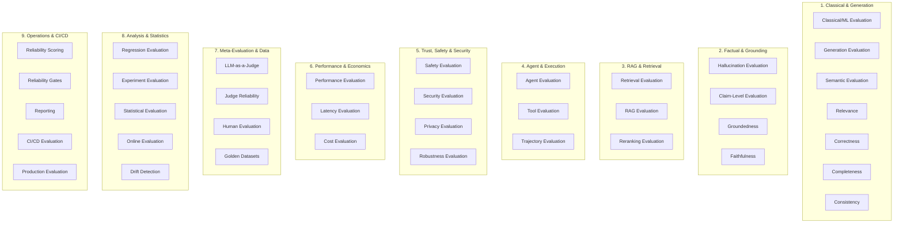
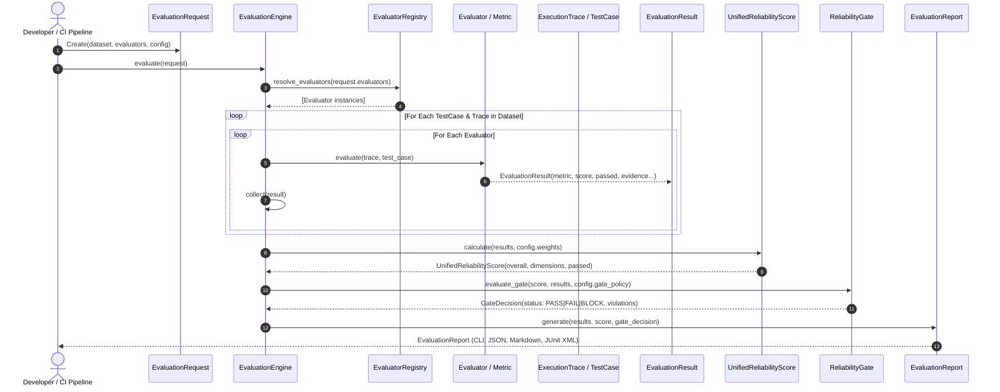

# Phase 30: AI Evaluation Platform Architecture & Specification (v0.2.0)

## Executive Summary

This document establishes the architectural foundation and formal specification for the **AI Evaluation Platform (v0.2.0)** of the `aireliability` Python package. 

Version `0.1.0` successfully delivered foundational systems spanning deterministic expectations, semantic evaluation (`SemanticJudge`, `MockSemanticJudge`, `SemanticRelevance`), root-cause diagnosis, automated regression synthesis, baseline tracking, distributed workers, multi-tenancy, security boundaries, and operational observability.

Version `0.2.0` elevates `aireliability` into an **enterprise-grade, provider-agnostic, multimodal AI Evaluation Platform**. It bridges offline development, golden dataset curation, continuous regression testing, production observability, and deployment gating into a unified, evidence-driven feedback loop.

---

## 1. Formal Evaluation Taxonomy (38 Dimensions)

The evaluation taxonomy provides an exhaustive, formal categorization of all evaluation capabilities across the AI lifecycle:



### Taxonomy Definitions & Scope

1. **Classical/ML Evaluation**: Deterministic statistical classification and ranking verification (Accuracy, Precision, Recall, F1, F-beta, Specificity, Sensitivity, Balanced Accuracy, Matthews Correlation Coefficient, Confusion Matrix, Macro/Micro/Weighted).
2. **Generation Evaluation**: Quality and format assessment of generative text (coherence, helpfulness, instruction-following, regex, json validity, json schema, required fields, citation presence/validity).
3. **Semantic Evaluation**: Linguistic meaning, semantic similarity, and criteria adherence using provider-independent judges.
4. **Hallucination Evaluation**: Detection and quantification of ungrounded or fabricated information in generated output.
5. **Claim-Level Evaluation**: Decomposition of generated text into atomic factual propositions, classification (Supported, Unsupported, Contradicted), and evidence provenance.
6. **Groundedness**: Extent to which claims are strictly anchored in provided context or retrieved documents.
7. **Faithfulness**: Extent to which the response remains faithful to source context without adding unverifiable extrapolations.
8. **Relevance**: Alignment of retrieved context or generated response to the original user query or prompt.
9. **Correctness**: Semantic, factual, and logical correctness relative to reference ground truth.
10. **Completeness**: Degree to which all required aspects, questions, and reference facts are addressed.
11. **Consistency**: Output and behavior stability across repeated executions ($N$-runs) with identical inputs.
12. **Retrieval Evaluation**: Precision@K, Recall@K, Hit@K, MRR, MAP, and NDCG over retrieved documents.
13. **RAG Evaluation**: End-to-end evaluation of the Retriever $\rightarrow$ Reranker $\rightarrow$ Context $\rightarrow$ Generator chain, attributing failures to retrieval vs. generation.
14. **Reranking Evaluation**: Independent measurement of reranker ranking quality, NDCG uplift, and Hit@K delta over raw retriever outputs.
15. **Agent Evaluation**: End-to-end evaluation of autonomous agent tasks, tool usage efficiency, planning, and goal attainment.
16. **Tool Evaluation**: Accuracy of tool selection, argument schemas, call ordering, error rates, and unnecessary invocation detection.
17. **Trajectory Evaluation**: Full trace analysis over multi-step agent trajectories (step count, loop detection, retry behavior, path optimality).
18. **Safety Evaluation**: Classification of harmful generation across toxicity, hate speech, harassment, self-harm, violence, and dangerous goods.
19. **Security Evaluation**: Robustness against adversarial attacks (direct/indirect prompt injection, jailbreaks, system prompt exfiltration, malicious tool arguments).
20. **Privacy Evaluation**: PII detection, credential/secret exposure, and data leakage across inputs, outputs, and intermediate tool arguments.
21. **Robustness Evaluation**: Behavioral stability under input perturbations (typos, casing, whitespace, noise, length variations, adversarial paraphrases).
22. **Performance Evaluation**: End-to-end throughput, time-to-first-token (TTFT), tokens/sec, and timeout rates across execution suites.
23. **Latency Evaluation**: Latency attribution broken down across retrieval, reranking, LLM generation, and external tool execution.
24. **Cost Evaluation**: Configurable pricing model for input tokens, output tokens, cached tokens, embedding calls, and tool APIs.
25. **LLM-as-a-Judge**: Modular judge providers (Mock, OpenAI, Anthropic, Gemini, Ollama, Custom HTTP/callable) preserving structured reasoning and evidence.
26. **Judge Reliability**: Meta-evaluation of judges: inter-judge agreement (Cohen's/Fleiss' Kappa), variance, calibration, position bias, length bias, and self-preference bias.
27. **Human Evaluation**: Ingestion of human feedback, ratings, pairwise comparisons, and human-vs-judge calibration.
28. **Golden Datasets**: Versioned, schema-validated test case datasets with tags, metadata, and dataset splits (dev, val, test, regression, production, adversarial).
29. **Regression Evaluation**: Automated diffing of baseline vs. current execution suites across quality, retrieval, safety, latency, and cost dimensions.
30. **Experiment Evaluation**: Systematic A/B comparisons between Model A vs B, Prompt A vs B, Retriever A vs B, tracking configuration provenance.
31. **Statistical Evaluation**: Bootstrap confidence intervals, statistical significance (p-values, Welch's t-test, Mann-Whitney U), and sample-size awareness.
32. **Online Evaluation**: Real-time sampling and evaluation of production execution traces.
33. **Drift Detection**: Identification of quality drift, retrieval drift, latency drift, cost drift, and distribution drift relative to historical baselines.
34. **Reliability Scoring**: Multidimensional composite score combining quality, retrieval, safety, performance, and cost, with critical safety veto logic.
35. **Reliability Gates**: Enforceable release gates with configurable rules (PASS, FAIL, BLOCK) preventing regressive deployments.
36. **Reporting**: Multi-format reporting engine (CLI, JSON, JSONL, CSV, Markdown, HTML, JUnit XML).
37. **CI/CD Evaluation**: Automated pipeline integration with exit codes, pull-request annotations, GitHub Actions step summaries, and JUnit test reports.
38. **Production Evaluation**: Closed-loop integration connecting production telemetry $\rightarrow$ trace $\rightarrow$ evaluation $\rightarrow$ root cause $\rightarrow$ regression test $\rightarrow$ golden dataset $\rightarrow$ CI gate.

---

## 2. Complete Repository Gap Matrix

The following Gap Matrix audits the existing codebase (`v0.1.0`) against the 38 required capabilities for `v0.2.0`:

| # | Capability | Status | Existing Implementation in `v0.1.0` | Existing Module / API | Required Extension | New Implementation for `v0.2.0` | Tests Required | Backward Compatibility Impact |
|---|---|---|---|---|---|---|---|---|
| **1** | Classical/ML Evaluation | **NEW** | Basic percentiles only | `observability.metrics.calculate_percentiles` | None | `evaluation.metrics.classification` (Accuracy, Precision, Recall, F1, F-beta, Specificity, Sensitivity, Balanced Acc, MCC, Confusion Matrix) | Deterministic mathematical unit tests | None (New module) |
| **2** | Generation Evaluation | **EXTEND** | `OutputEquals`, `OutputContains`, `SchemaMatch` | `evaluation.expectations` | Support regex, JSON validation, citation checks, instruction following | `evaluation.generation` (RegexMatch, JsonValid, RequiredFields, CitationCheck, InstructionFollowingEvaluator) | Unit tests with malformed and valid text | Full backward compatibility (existing expectations preserved) |
| **3** | Semantic Evaluation | **EXTEND** | `SemanticJudge`, `MockSemanticJudge`, `SemanticRelevance`, `SemanticSimilarity` | `evaluation.semantic.*` | Unify with `EvaluationEngine` and extensible provider registry | Modular provider adapters, multi-criteria evaluation | Integration tests with mock & providers | Full backward compatibility (existing classes preserved) |
| **4** | Hallucination Evaluation | **NEW** | `FailureType.HALLUCINATION`, `FailureType.UNSUPPORTED_CLAIM` in taxonomy | `failures.taxonomy.FailureType` | Link failure analyzer to hallucination scores | `evaluation.claim.hallucination` (`HallucinationEvaluator`, hallucination rate metric) | Claim-based hallucination detection tests | None (New evaluator) |
| **5** | Claim-Level Evaluation | **NEW** | None | N/A | None | `evaluation.claim.extractor`, `evaluation.claim.classifier` (Supported, Unsupported, Contradicted) | Extraction & classification unit tests | None (New module) |
| **6** | Groundedness | **NEW** | Context dictionary accepted in `SemanticExpectation` | `evaluation.semantic.expectations.SemanticExpectation` | Expose groundedness metric | `evaluation.claim.groundedness` (`GroundednessEvaluator`, grounded claim rate) | Grounding against context snippets tests | None (New evaluator) |
| **7** | Faithfulness | **NEW** | Criteria string matching in `MockSemanticJudge` | `evaluation.semantic.mock_judge` | Formalize faithfulness metric | `evaluation.claim.faithfulness` (`FaithfulnessEvaluator`, context adherence score) | Faithfulness and contradiction tests | None (New evaluator) |
| **8** | Relevance | **EXTEND** | `SemanticRelevance` expectation | `evaluation.semantic.expectations.SemanticRelevance` | Add context relevance and prompt relevance metrics | `evaluation.metrics.relevance` (`ContextRelevance`, `AnswerRelevance`) | Scoring boundary tests | Full backward compatibility |
| **9** | Correctness | **EXTEND** | `OutputEquals`, `SemanticSimilarity` | `evaluation.expectations`, `evaluation.semantic` | Factual correctness combining reference & judge | `evaluation.generation.correctness` (`CorrectnessEvaluator`) | Reference matching tests | Full backward compatibility |
| **10** | Completeness | **NEW** | Ad-hoc criteria in `MockSemanticJudge` | `evaluation.semantic.mock_judge` | None | `evaluation.generation.completeness` (`CompletenessEvaluator`, entity/point coverage) | Coverage calculation tests | None (New evaluator) |
| **11** | Consistency | **NEW** | None | N/A | None | `evaluation.consistency` (`ConsistencyEvaluator`, $N$-run harness, variance scoring) | Multi-run repetition tests | None (New module) |
| **12** | Retrieval Evaluation | **NEW** | `StepType.RETRIEVAL`, `FailureCategory.RETRIEVAL` | `core.models.StepType`, `failures.taxonomy` | Connect to trace retrieval steps | `evaluation.rag.retrieval` (Precision@K, Recall@K, Hit@K, MRR, MAP, NDCG) | Mathematical ranking metric tests | None (New module) |
| **13** | RAG Evaluation | **NEW** | None | N/A | Connect to `RootCauseAnalyzer` | `evaluation.rag.pipeline` (`RAGEvaluator`, retrieval vs generation attribution) | End-to-end RAG pipeline tests | None (New module) |
| **14** | Reranking Evaluation | **NEW** | None | N/A | None | `evaluation.rag.reranking` (`RerankingEvaluator`, ranking delta, NDCG uplift) | Pre/post rerank comparison tests | None (New module) |
| **15** | Agent Evaluation | **EXTEND** | `ToolCalled`, `ToolNotCalled`, `ToolOrder`, `ToolArguments` | `evaluation.expectations` | Add efficiency, planning, task success rate | `evaluation.agents.evaluator` (`AgentEvaluator`, task success, planning accuracy) | Agent trajectory evaluation tests | Full backward compatibility |
| **16** | Tool Evaluation | **EXTEND** | Tool assertions in expectations | `evaluation.expectations` | Detect unnecessary calls, compute tool error rate | `evaluation.agents.tools` (`ToolUsageEvaluator`, tool error rate, unnecessary call detector) | Tool sequence and argument tests | Full backward compatibility |
| **17** | Trajectory Evaluation | **NEW** | Sequential steps in `ExecutionTrace.steps` | `core.models.ExecutionTrace` | Analyze complete trace step chains | `evaluation.agents.trajectory` (`TrajectoryEvaluator`, loop detection, step budget) | Circular loop & trajectory tests | None (New module) |
| **18** | Safety Evaluation | **NEW** | `FailureCategory.SAFETY`, `FailureType.SAFETY_VIOLATION` | `failures.taxonomy` | Link safety violations to root causes | `evaluation.safety` (`SafetyEvaluator`, toxicity, hate, harassment, violence, dangerous content) | Safety classification unit tests | None (New module) |
| **19** | Security Evaluation | **NEW** | Security Gateway (auth/authz/tokens/replay) in `security/` | `security.gateway.SecurityGateway` | Integrate LLM security evaluation with security audit | `evaluation.security` (`SecurityEvaluator`, prompt injection, jailbreaks, prompt leakage) | Injection & jailbreak detection tests | None (New module) |
| **20** | Privacy Evaluation | **EXTEND** | `TelemetrySanitizer`, `SanitizationPolicy` | `telemetry.sanitizer` | Adapt sanitization policies into evaluation metrics | `evaluation.privacy` (`PrivacyEvaluator`, PII leakage rate, secret detection) | PII detection and regex tests | Full backward compatibility |
| **21** | Robustness Evaluation | **NEW** | None | N/A | None | `evaluation.robustness` (`RobustnessEvaluator`, perturbation engine: typos, casing, noise, adversarial) | Perturbation stability tests | None (New module) |
| **22** | Performance Evaluation | **EXTEND** | `duration_ms` on TraceStep, `calculate_percentiles` | `core.models`, `observability.metrics` | Compute suite-level TTFT, throughput, tokens/sec | `evaluation.performance` (`PerformanceEvaluator`, throughput, TTFT, token velocity) | Performance aggregation tests | Full backward compatibility |
| **23** | Latency Evaluation | **EXTEND** | `MaxLatency` expectation | `evaluation.expectations.MaxLatency` | Break down latency per step/component | `evaluation.performance.latency` (`LatencyAttributionEvaluator`, step-level latency) | Multi-step trace latency tests | Full backward compatibility |
| **24** | Cost Evaluation | **EXTEND** | `MaxCost` expectation, `ExecutionTrace.cost` | `evaluation.expectations.MaxCost`, `core.models` | Make pricing model configurable per provider/model | `evaluation.cost` (`CostEvaluator`, `PricingModel`, cost/1k requests, token cost breakdowns) | Dynamic pricing calculation tests | Full backward compatibility |
| **25** | LLM-as-a-Judge | **EXTEND** | `SemanticJudge` protocol, `MockSemanticJudge`, `JudgeResult` | `evaluation.semantic.*` | Add provider adapters without mandatory heavy SDKs | `evaluation.judges.providers` (OpenAI, Anthropic, Gemini, Ollama, Custom HTTP adapters) | Provider adapter and fallback tests | Full backward compatibility (core remains lightweight) |
| **26** | Judge Reliability | **NEW** | None | N/A | None | `evaluation.judges.reliability` (`JudgeReliabilityEvaluator`, Cohen's/Fleiss' Kappa, bias detectors) | Agreement and bias metric tests | None (New module) |
| **27** | Human Evaluation | **NEW** | None | N/A | None | `evaluation.human` (`HumanEvaluationSchema`, feedback ingestion, human-judge calibration) | Human rating schema tests | None (New module) |
| **28** | Golden Datasets | **EXTEND** | `TestCase` model, JSON file loader | `core.models.TestCase`, `cli.load_test_cases_from_dir` | Support dataset versioning, splits, tags, import/export | `evaluation.datasets` (`EvaluationDataset`, splits: dev/val/test/regression/adversarial, export/import JSON/JSONL/CSV) | Dataset serialization & split tests | Full backward compatibility (`TestCase` unchanged) |
| **29** | Regression Evaluation | **EXTEND** | `BaselineManager`, `RegressionGenerator`, `RegressionRunner` | `regression.*` | Add multidimensional diffing (quality, safety, latency, cost) | `evaluation.regression.diff` (`EvaluationRegressionDetector`, baseline comparison summary) | Regression detection across dimensions tests | Full backward compatibility (existing `BaselineManager` preserved) |
| **30** | Experiment Evaluation | **NEW** | Single-baseline comparison | `regression.baseline.BaselineManager` | Compare multiple variants (A/B testing) | `evaluation.experiments` (`ExperimentManager`, variant comparisons: Prompt A vs B, Model A vs B) | Experiment tracking & diff tests | None (New module) |
| **31** | Statistical Evaluation | **NEW** | Simple z-score in `StatisticalAnomalyDetector` | `observability.anomaly` | Statistical hypothesis testing & confidence intervals | `evaluation.statistics` (Bootstrap CI, Welch's t-test, Mann-Whitney U, Cohen's d, effect size) | Mathematical statistical tests | None (New module) |
| **32** | Online Evaluation | **EXTEND** | `ObservabilityManager`, `EventRecorder` | `observability.*` | Feed sampled traces to `EvaluationEngine` | `evaluation.online` (`OnlineEvaluationBridge`, trace sampler, background evaluator) | Online sampling & eval tests | Full backward compatibility |
| **33** | Drift Detection | **EXTEND** | `StatisticalAnomalyDetector` | `observability.anomaly` | Detect evaluation score drift and distribution shifts | `evaluation.drift` (`EvaluationDriftDetector`, Wasserstein/PSI drift, score trend alerts) | Score drift detection tests | Full backward compatibility |
| **34** | Reliability Scoring | **NEW** | `HealthSnapshot.success_rate` in observability | `observability.models.HealthSnapshot` | Multidimensional composite score with safety veto | `evaluation.governance.scoring` (`UnifiedReliabilityScore`, weighted dimensions, critical gate override) | Composite score & veto tests | None (New module) |
| **35** | Reliability Gates | **NEW** | CLI exit code 1 on regression | `cli.cmd_test` | Configurable policy engine (PASS, FAIL, BLOCK) | `evaluation.governance.gates` (`ReliabilityGate`, policy rules, threshold enforcement) | Gate decision policy tests | None (New module) |
| **36** | Reporting | **EXTEND** | CLI stdout, basic JSON/Markdown in `cli.py` | `cli.cmd_test`, `cli.cmd_compare` | Unified reporting engine supporting multiple formats | `evaluation.reporting` (`ReportGenerator`, formatters: CLI, JSON, JSONL, CSV, Markdown, HTML, JUnit XML) | Formatter output validation tests | Full backward compatibility |
| **37** | CI/CD Evaluation | **EXTEND** | Exit codes in `cli.py` | `cli.py` | GitHub Actions summaries, JUnit XML output, PR annotations | `evaluation.cicd` (`CIExecutor`, GitHub step summary, JUnit exporter) | CI exit code & artifact tests | Full backward compatibility |
| **38** | Production Evaluation | **EXTEND** | `ControlPlane`, distributed storage, telemetry | `control_plane`, `distributed`, `telemetry` | Wire closed loop: Production $\rightarrow$ Trace $\rightarrow$ Eval $\rightarrow$ Root Cause $\rightarrow$ Regression $\rightarrow$ Golden Dataset | `evaluation.production` (`ProductionFeedbackLoop`, trace ingestion, auto-regression pipeline) | End-to-end feedback loop tests | Full backward compatibility |

---

## 3. Target Conceptual Architecture & Unified Abstraction

The unified evaluation pipeline follows this architecture:

```
EvaluationRequest
        ↓
EvaluationEngine
        ↓
Evaluator Registry
        ↓
Evaluator  ──[produces]──▶  Metric (MetricResult)
        ↓
EvaluationResult  (Enriched with Provenance & Evidence)
        ↓
EvaluationReport  (Aggregated Summary, Dimension Breakdown, Reliability Score, Gate Decision)
```

### Detailed Component Interaction Flow



---

## 4. API Contracts and Data Specifications

### 4.1 Backward-Compatible Enriched `EvaluationResult`

In `aireliability.core.models`, the existing `EvaluationResult` model is extended with optional fields with default values, ensuring existing callers continue to work without breaking changes:

```python
class EvaluationResult(BaseModel):
    """Result of an evaluation assertion or evaluator against a trace."""

    model_config = ConfigDict(frozen=True)

    evaluator: str
    passed: bool
    score: float | None = None
    message: str = ""
    evidence: Any = None
    metadata: dict[str, Any] = Field(default_factory=dict)

    # v0.2.0 Extensions (All optional with defaults for full backward compatibility)
    metric: str | None = None
    threshold: float | None = None
    confidence: float | None = None
    reasoning: str | None = None
    evaluator_type: str | None = None  # deterministic, semantic, safety, rag, etc.
    provider: str | None = None
    model: str | None = None
    dataset: str | None = None
    test_case: str | None = None
    execution_id: str | None = None
    timestamp: datetime = Field(default_factory=_utc_now)
    latency: float | None = None
    cost: float | None = None

    @model_validator(mode="after")
    def validate_score(self) -> "EvaluationResult":
        """Ensure score is within [0.0, 1.0] if provided."""
        if self.score is not None and not (0.0 <= self.score <= 1.0):
            raise ValueError(f"score must be between 0.0 and 1.0, got {self.score}")
        return self
```

### 4.2 Unified Evaluation Engine Models

#### `EvaluationRequest`
```python
class EvaluationTarget(BaseModel):
    """Target under evaluation: an agent callable, an API endpoint, or historical traces."""

    model_config = ConfigDict(frozen=True)
    name: str
    agent: Any | None = None
    traces: list[ExecutionTrace] = Field(default_factory=list)
    metadata: dict[str, Any] = Field(default_factory=dict)


class EvaluationRequest(BaseModel):
    """Specification of an evaluation run across test cases or datasets."""

    model_config = ConfigDict(frozen=True)
    request_id: str = Field(default_factory=lambda: _generate_id("eval_req"))
    dataset: str | EvaluationDataset
    target: EvaluationTarget
    evaluators: list[str | Evaluator] = Field(default_factory=list)
    metrics: list[str] = Field(default_factory=list)
    gate_policy: GatePolicy | None = None
    concurrency: int = 1
    sample_rate: float = 1.0
    timeout_seconds: float = 300.0
    tags: list[str] = Field(default_factory=list)
    metadata: dict[str, Any] = Field(default_factory=dict)
```

#### `MetricResult`
```python
class MetricResult(BaseModel):
    """Represents a computed statistical or quantitative metric value."""

    model_config = ConfigDict(frozen=True)
    name: str
    value: float
    dimension: str = "quality"  # quality, retrieval, safety, performance, cost
    sample_count: int = 1
    confidence_interval: tuple[float, float] | None = None
    p_value: float | None = None
    metadata: dict[str, Any] = Field(default_factory=dict)
```

#### `EvaluatorRegistry`
```python
class EvaluatorRegistry:
    """Thread-safe registry for discovering and instantiating evaluators and metrics."""

    _evaluators: dict[str, type[Evaluator]] = {}
    _metrics: dict[str, type[Metric]] = {}

    @classmethod
    def register_evaluator(cls, name: str, evaluator_cls: type[Evaluator]) -> None: ...

    @classmethod
    def get_evaluator(cls, name: str, **kwargs: Any) -> Evaluator: ...

    @classmethod
    def list_evaluators(cls) -> list[str]: ...
```

#### `UnifiedReliabilityScore`
```python
class DimensionScore(BaseModel):
    """Score breakdown for a specific evaluation dimension."""

    dimension: str
    score: float = Field(ge=0.0, le=1.0)
    weight: float = 1.0
    passed: bool
    violations: list[str] = Field(default_factory=list)


class UnifiedReliabilityScore(BaseModel):
    """Multidimensional reliability score combining all evaluated facets."""

    overall_score: float = Field(ge=0.0, le=1.0)
    dimensions: dict[str, DimensionScore]
    passed: bool
    critical_safety_veto: bool = False
    veto_reasons: list[str] = Field(default_factory=list)
    explanation: str = ""
```

#### `ReliabilityGate` and `GatePolicy`
```python
class GateStatus(StrEnum):
    PASS = "pass"
    FAIL = "fail"
    BLOCK = "block"


class GatePolicy(BaseModel):
    """Configurable release gate thresholds and blocking policies."""

    min_overall_score: float = 0.85
    min_dimension_scores: dict[str, float] = Field(
        default_factory=lambda: {
            "quality": 0.80,
            "retrieval": 0.75,
            "safety": 0.99,
            "security": 0.99,
        }
    )
    max_hallucination_rate: float = 0.05
    max_latency_p95_ms: float = 2000.0
    max_cost_per_task: float = 0.05
    max_allowed_regressions: int = 0
    block_on_critical_safety: bool = True


class GateDecision(BaseModel):
    """Enforceable decision returned by ReliabilityGate."""

    status: GateStatus
    passed: bool
    reasons: list[str] = Field(default_factory=list)
    violations: list[dict[str, Any]] = Field(default_factory=list)
```

#### `EvaluationReport`
```python
class EvaluationReport(BaseModel):
    """Comprehensive evaluation report summarizing a complete evaluation run."""

    report_id: str = Field(default_factory=lambda: _generate_id("eval_rep"))
    request_id: str
    target_name: str
    dataset_id: str
    timestamp: datetime = Field(default_factory=_utc_now)
    total_test_cases: int
    passed_test_cases: int
    failed_test_cases: int
    evaluations: list[EvaluationResult] = Field(default_factory=list)
    metrics: dict[str, MetricResult] = Field(default_factory=dict)
    reliability_score: UnifiedReliabilityScore
    gate_decision: GateDecision
    failures: list[FailureReport] = Field(default_factory=list)
    root_causes: list[RootCauseReport] = Field(default_factory=list)
    regressions: list[ComparisonResult] = Field(default_factory=list)
    recommendations: list[str] = Field(default_factory=list)
    metadata: dict[str, Any] = Field(default_factory=dict)
```

---

## 5. Architectural Alignment with Existing Systems

To adhere strictly to the project rules, v0.2.0 reuses and extends existing modules rather than re-implementing them:

1. **Semantic Evaluation**:
   - `SemanticJudge`, `MockSemanticJudge`, `JudgeResult`, and `SemanticExpectation` remain the exact bedrock.
   - Provider adapters (`OpenAIJudge`, `AnthropicJudge`, `GeminiJudge`, `OllamaJudge`) implement `SemanticJudge`.
   - Lazy dynamic imports ensure core dependencies remain lightweight with zero mandatory external SDKs.

2. **Root-Cause Analysis**:
   - Diagnoses from `RootCauseAnalyzer` are directly attached to `EvaluationReport.root_causes`.
   - Retrieval and hallucination failures automatically map to `RootCauseCategory.RETRIEVAL` and `RootCauseCategory.OUTPUT`.

3. **Regression Testing & Baseline Management**:
   - `BaselineManager` and `RegressionGenerator` are leveraged directly.
   - Any evaluation failure that regresses from a baseline automatically triggers `RegressionGenerator.generate()`.

4. **Observability & Anomaly Detection**:
   - Evaluated metrics feed into `MetricsEngine` and `StatisticalAnomalyDetector`.
   - Real-time production traces from `ObservabilityManager` can be streamed into `EvaluationEngine.evaluate_traces()`.

5. **Security & Sanitization**:
   - `TelemetrySanitizer` and `SanitizationPolicy` are reused to sanitize evaluation inputs, outputs, and evidence payloads.
   - Gateway security events correlate with LLM security evaluations.

---

## 6. Phase Phasing & Delivery Roadmap

The delivery of v0.2.0 is structured into four sequential phases:

```mermaid
gantt
    title AI Evaluation Platform v0.2.0 Delivery Roadmap
    dateFormat  X
    axisFormat %s

    section Phase 30
    Architecture & Gap Analysis       :done, p30, 0, 1

    section Phase 31
    Metrics Engine                    :active, p31_1, 1, 2
    Generation & Semantic Evaluators  :p31_2, 2, 3
    Hallucination & Claim Evaluator   :p31_3, 3, 4
    RAG & Retrieval Evaluators        :p31_4, 4, 5
    Agent & Trajectory Evaluators     :p31_5, 5, 6
    Safety, Security & Privacy        :p31_6, 6, 7
    Robustness, Consistency, Cost     :p31_7, 7, 8
    Judges, Datasets & Statistics     :p31_8, 8, 9

    section Phase 32
    Unified Reliability Scoring       :p32_1, 9, 10
    Reliability Gates Policy Engine   :p32_2, 10, 11
    Multi-format Reporting Engine     :p32_3, 11, 12

    section Phase 33
    CLI Extension (`airel evaluate`)   :p33_1, 12, 13
    Evaluation Dashboard & CI/CD      :p33_2, 13, 14
    Production Feedback Loop          :p33_3, 14, 15
    Full Test Suite & Verification    :p33_4, 15, 16
```



---

## 7. Verification and Acceptance Criteria for Phase 30

- [x] Complete repository inspection across all 29 existing phases.
- [x] Verification that all existing 362 unit and integration tests pass without error.
- [x] Formal 38-dimension evaluation taxonomy documented.
- [x] Comprehensive Gap Matrix completed covering Capability, Existing Implementation, Existing API, Required Extension, New Implementation, Tests Required, and Backward Compatibility Impact.
- [x] Unified evaluation architecture (`EvaluationRequest` $\rightarrow$ `EvaluationEngine` $\rightarrow$ `EvaluatorRegistry` $\rightarrow$ `Evaluator` $\rightarrow$ `Metric` $\rightarrow$ `EvaluationResult` $\rightarrow$ `EvaluationReport`) designed.
- [x] Backward-compatible enriched `EvaluationResult` model specified with non-breaking field additions.
- [x] API contracts for Registry, Engine, Scoring, Gating, and Reporting fully specified.
- [x] Zero breaking changes or removals of existing public APIs.
